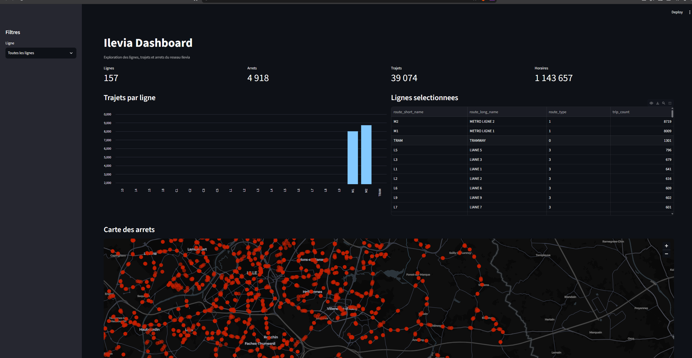

# Ilevia Data Analysis

Projet d’exploration et de visualisation des données GTFS du réseau Ilevia.

## Aperçu du dashboard



Le dashboard Streamlit permet de filtrer les lignes, comparer le nombre de
trajets, consulter les statistiques du réseau, afficher les arrêts sur une
carte et explorer les trajets disponibles.

## Installation

```bash
git clone <url-du-depot>
cd metro_data
python3 -m venv .venv
source .venv/bin/activate
python -m pip install -r requirements.txt
```

## Lancer le dashboard

```bash
source .venv/bin/activate
streamlit run dashboard.py
```

Ouvre ensuite [http://localhost:8501](http://localhost:8501) dans ton navigateur.

## Données

- `data/raw/` contient les fichiers GTFS originaux disponibles ;
- `data/processed/` contient les tables nettoyées au format CSV ;
- les fichiers actuellement disponibles sont `agency`, `routes`, `stops`,
	`stop_times` et `trips` ;
- `calendar.txt` et `shapes.txt` pourront être ajoutés lorsque les sources
	seront disponibles.

## Organisation du projet

```text
data/raw/          Sources GTFS originales
data/processed/    Données nettoyées
src/               Chargement, nettoyage, analyse et visualisation
notebooks/         Analyse exploratoire Jupyter
sql/               Schéma, import et requêtes SQL
reports/           Rapport d’analyse
docs/              Captures et documentation visuelle
dashboard.py       Application Streamlit
```

## Notebook

Ouvre `notebooks/analysis.ipynb` dans VS Code, sélectionne l’interpréteur
`.venv`, puis exécute les cellules avec **Run All**.

## Nettoyage des données

Le nettoyage est disponible dans `src/cleaning.py`. Il supprime les espaces
inutiles, les lignes vides et les doublons, puis écrit les résultats dans
`data/processed/`.

## SQL

Les scripts du dossier `sql/` définissent les tables, indiquent comment
importer les CSV nettoyés et proposent des requêtes d’analyse.
